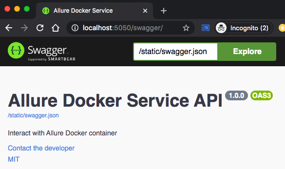
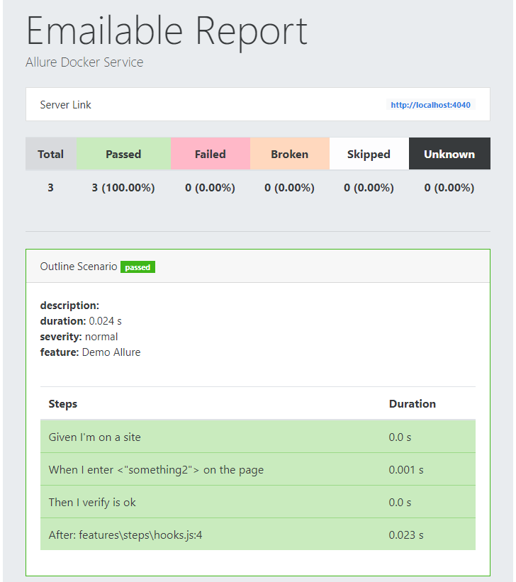
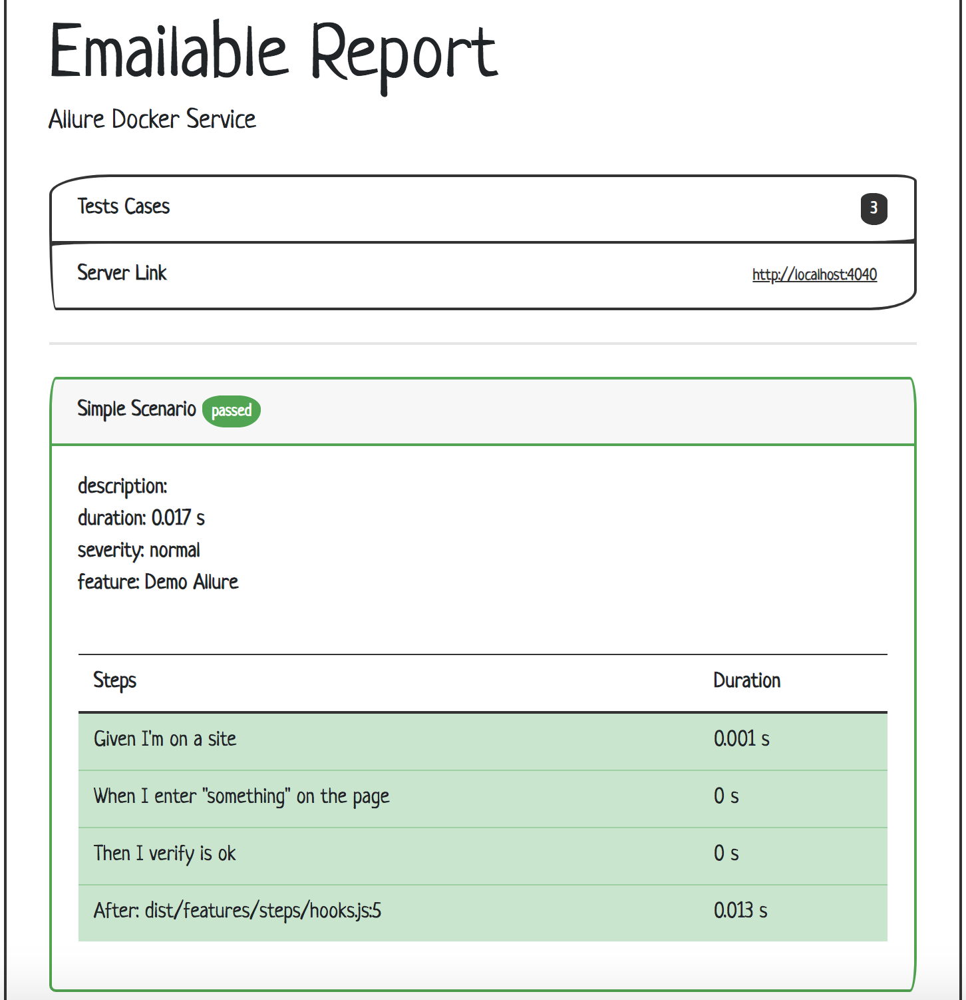
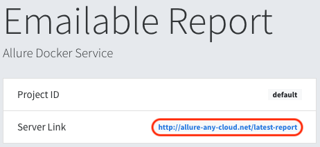

[](http://allure.qatools.ru/)
[](https://docs.docker.com/)

# ALLURE DOCKER SERVICE
Table of contents
=================
   * [FEATURES](#FEATURES)
      * [Docker Hub](#docker-hub)
      * [Docker Versions](#docker-versions)
   * [USAGE](#USAGE)
      * [Generate Allure Results](#generate-allure-results)
      * [Allure Docker Service](#allure-docker-service-1)
          * [Using Docker on Unix/Mac](#using-docker-on-unixmac)
          * [Using Docker on Windows (Git Bash)](#using-docker-on-windows-git-bash)
          * [Using Docker Compose](#using-docker-compose)
      * [Opening & Refreshing Report](#opening--refreshing-report)
      * [Extra options](#extra-options)
          * [Allure API](#allure-api)
          * [Send results through API](#send-results-through-api)
          * [Switching version](#switching-version)
          * [Switching port](#switching-port)
          * [Updating seconds to check Allure Results](#updating-seconds-to-check-allure-results)
          * [Keep History and Trends](#keep-history-and-trends)
          * [Customize Emailable Report](#customize-emailable-report)
              * [Override CSS](#override-css)
              * [Override server link](#override-server-link)
              * [Develop a new template](#develop-a-new-template)
          * [Using Allure Options](#using-allure-options)
   * [DOCKER GENERATION (Usage for developers)](#docker-generation-usage-for-developers)

## FEATURES
Allure Framework provides you good looking reports for automation testing.
For using this tool it's required to install a server. You could have this server running on Jenkins or if you want to see reports locally you need run some commands on your machine. This work results tedious, at least for me :)

For that reason this docker container allows you to see up to date reports simply mounting your `allure-results` directory in the container. Every time appears new results (generated for your tests), Allure Docker Service will detect those changes and it will generate a new report automatically (optional: generate report on demand via API), what you will see refreshing your browser.

It's useful even for developers who wants to run tests locally and want to see what were the problems during regressions.

### Docker Hub
- Repository: [frankescobar/allure-docker-service](https://hub.docker.com/r/frankescobar/allure-docker-service/)

### Docker Versions
Docker container versions are based on binary [Allure 2 releases](https://github.com/allure-framework/allure2/releases/)

#### Image Variants
Allure Docker Service supports architectures amd64, arm32v7 and arm64v8.

- Tags: https://hub.docker.com/r/frankescobar/allure-docker-service/tags

The following table shows the variation of provided images.

|**Tag**         |**Base Image**           |**Arch** | **OS** |
|----------------|-------------------------|---------|--------|
| 0.20.7-amd64   | amd64/openjdk:11-slim   | amd64   | debian |
| 0.20.7-arm32v7 | arm32v7/openjdk:11-slim | arm32v7 | debian |
| 0.20.7-arm64v8 | arm64v8/openjdk:11-slim | arm64v8 | debian |

The following table shows the provided Manifest Lists.

| **Tag**                                | **Allure Base Image**         |
|----------------------------------------|---------------------------------|
| latest, 2.12.1                         | raymondmm/allure:2.12.1-amd64   |
|                                        | raymondmm/allure:2.12.1-arm32v7 |
|                                        | raymondmm/allure:2.12.1-arm64v8 |

## USAGE
### Generate Allure Results
First at all it's important to be clear. This container only generates reports based on results. You have to generate allure results according to the technology what are you using.

We have some examples projects:
- [allure-docker-java-testng-example](allure-docker-java-testng-example)
- [allure-docker-java-cucumber-jvm-example](allure-docker-java-cucumber-jvm-example)
- [allure-docker-nodejs-example](allure-docker-nodejs-example)
- [allure-docker-nodejs-typescript-example](allure-docker-nodejs-typescript-example)
- [AllureDockerCSharpExample](AllureDockerCSharpExample)

In this case we are going to generate results using the java project [allure-docker-java-testng-example](allure-docker-java-testng-example) of this repository.

Go to directory [allure-docker-java-testng-example](allure-docker-java-testng-example) via command line:

```sh
cd allure-docker-java-testng-example
```
Execute:

```sh
mvn test -Dtest=FirstTestNGAllureTest
```
If everything is OK, you should see something like this:

```sh
[INFO] -------------------------------------------------------
[INFO]  T E S T S
[INFO] -------------------------------------------------------
[INFO] Running com.allure.docker.FirstTestNGAllureTest
SLF4J: Failed to load class "org.slf4j.impl.StaticLoggerBinder".
SLF4J: Defaulting to no-operation (NOP) logger implementation
SLF4J: See http://www.slf4j.org/codes.html#StaticLoggerBinder for further details.
test1
test2
[ERROR] Tests run: 2, Failures: 1, Errors: 0, Skipped: 0, Time elapsed: 2.419 s <<< FAILURE! - in com.allure.docker.FirstTestNGAllureTest
[ERROR] test2(com.allure.docker.FirstTestNGAllureTest)  Time elapsed: 0.042 s  <<< FAILURE!
java.lang.AssertionError: ERROR DURING THE TEST
        at com.allure.docker.FirstTestNGAllureTest.test2(FirstTestNGAllureTest.java:42)

[INFO] 
[INFO] Results:
[INFO] 
[ERROR] Failures: 
[ERROR]   FirstTestNGAllureTest.test2:42 ERROR DURING THE TEST
[INFO] 
[ERROR] Tests run: 2, Failures: 1, Errors: 0, Skipped: 0
[INFO] 
[INFO] ------------------------------------------------------------------------
[INFO] BUILD FAILURE
[INFO] ------------------------------------------------------------------------
```

There are 2 tests, one of them failed. Now you can see the `allure-results` diretory was created inside of [allure-docker-java-testng-example](allure-docker-java-testng-example) project.

Just it has left 1 step more. You have to run `allure-docker-service` mounting your `allure-results` directory.

### Allure Docker Service
Docker Image: https://hub.docker.com/r/frankescobar/allure-docker-service/

#### Using Docker on Unix/Mac
From this directory [allure-docker-java-testng-example](allure-docker-java-testng-example) execute next command:
```sh
docker run -p 4040:4040 -p 5050:5050 -e CHECK_RESULTS_EVERY_SECONDS=3 -e KEEP_HISTORY="TRUE" -v ${PWD}/allure-results:/app/allure-results frankescobar/allure-docker-service
```

#### Using Docker on Windows (Git Bash)
From this directory [allure-docker-java-testng-example](allure-docker-java-testng-example) execute next command:
```sh
docker run -p 4040:4040 -p 5050:5050 -e CHECK_RESULTS_EVERY_SECONDS=3 -e KEEP_HISTORY="TRUE" -v "/$(pwd)/allure-results:/app/allure-results" frankescobar/allure-docker-service
```

#### Using Docker Compose
Using docker-compose is the best way to manage containers: [allure-docker-java-testng-example/docker-compose.yml](allure-docker-java-testng-example/docker-compose.yml)

```sh
version: '3'
services:
  allure:
    image: "frankescobar/allure-docker-service"
    environment:
      CHECK_RESULTS_EVERY_SECONDS: 1
      KEEP_HISTORY: "TRUE"
    ports:
      - "4040:4040"
      - "5050:5050"
    volumes:
      - ${PWD}/allure-results:/app/allure-results
```

From this directory [allure-docker-java-testng-example](allure-docker-java-testng-example) execute next command:

```sh
docker-compose up allure
```

If you want to run in background:

```sh
docker-compose up -d allure
```

You can see the logs:

```sh
docker-compose logs -f allure
```

NOTE:
- The `${PWD}/allure-results` directory could be in anywhere on your machine. Your project must generate results in that directory.
- The `/app/allure-results` directory is inside of the container. You MUST NOT change this directory, otherwise, the container won't detect the new changes.

### Opening & Refreshing Report
If everything was OK, you will see this:
```sh
allure_1  | Opening existing report
allure_1  | Overriding configuration
allure_1  | Checking Allure Results every 1 second/s
allure_1  |  * Serving Flask app "app" (lazy loading)
allure_1  |  * Environment: production
allure_1  |    WARNING: This is a development server. Do not use it in a production deployment.
allure_1  |    Use a production WSGI server instead.
allure_1  |  * Debug mode: off
allure_1  |  * Running on http://0.0.0.0:5050/ (Press CTRL+C to quit)
allure_1  | Starting web server...
allure_1  | 2019-08-15 10:09:14.715:INFO::main: Logging initialized @219ms to org.eclipse.jetty.util.log.StdErrLog
allure_1  | Can not open browser because this capability is not supported on your platform. You can use the link below to open the report manually.
allure_1  | Server started at <http://192.168.224.2:4040/>. Press <Ctrl+C> to exit
allure_1  | Detecting results changes...
allure_1  | Creating history on results directory...
allure_1  | Copying history from previous results...
allure_1  | Generating report
allure_1  | Report successfully generated to allure-report
allure_1  | 127.0.0.1 - - [15/Aug/2019 10:09:20] "GET /emailable-report/render HTTP/1.1" 200 -
allure_1  | Status: 200
```

All previous examples started the container using port 4040. Simply open your browser and access to: 

http://localhost:4040

[](images/allure01.png)

[](images/allure02.png)

[](images/allure03.png)

Now we can run other tests without being worried about Allure server. You don't need to restart or execute any Allure command.

Just go again to this directory [allure-docker-java-testng-example](allure-docker-java-testng-example) via command line:
```sh
cd allure-docker-java-testng-example
```

And execute another suite test:
```sh
mvn test -Dtest=SecondTestNGAllureTest
```
When this second test finished, refresh your browser and you will see there is a new report including last results tests.

[](images/allure04.png)

[](images/allure05.png)

### Extra options

#### Allure API
Available endpoints:

`'GET'    /version`

`'POST'   /send-results`

`'GET'    /generate-report`

`'GET'    /clean-results`

`'GET'    /clean-history`

`'GET'    /emailable-report/render`

`'GET'    /emailable-report/export`

Access to http://localhost:5050 to see Swagger documentation with examples

[](images/allure-api.png)

#### Send results through API
`Available from Allure Docker Service version 2.12.1`

After running your tests, you can execute any script to send the generated results from any server to the Allure container using the [Allure API](#allure-api). For that you can use the endpoint `/send-results`.

Here a python script as example: [allure-docker-api-usage/send_results.py](allure-docker-api-usage/send_results.py)

```sh
python send_results.py
```

This script is sending these results as example [allure-docker-api-usage/allure-results-example](allure-docker-api-usage/allure-results-example)

If you want to clean the results use the endpoint `/clean-results` ([Allure API](#allure-api)).

#### Switching version
You can switch the version container using `frankescobar/allure-docker-service:${VERSION_NUMBER}`.
Docker Compose example:
```sh
  allure:
    image: "frankescobar/allure-docker-service:2.12.1"
```
or using latest version:

```sh
  allure:
    image: "frankescobar/allure-docker-service:latest"
```

By default it will take last version: https://hub.docker.com/r/frankescobar/allure-docker-service/tags

#### Switching port
Inside of the container `Allure Report` use port `4040` and `Allure API` use port `5050`.
You can switch those ports according to your convenience.
Docker Compose example:
```sh
    ports:
      - "8484:4040"
      - "9292:5050"
```
#### Updating seconds to check Allure Results
Updating seconds to check `allure-results` directory to generate a new report up to date.
Docker Compose example:
```sh
    environment:
      CHECK_RESULTS_EVERY_SECONDS: 5
```
Use `NONE` value to disable automatic checking results.
If you use this option, the only way to generate a new report up to date it's using the [Allure API](#allure-api).
```sh
    environment:
      CHECK_RESULTS_EVERY_SECONDS: NONE
```

#### Keep History and Trends
`Available from Allure Docker Service version 2.12.1`

Enable `KEEP_HISTORY` environment variable to work with history & trends

Docker Compose example:
```sh
    environment:
      KEEP_HISTORY: "TRUE"
```
If you want to clean the history use the [Allure API](#allure-api).


#### Customize Emailable Report
`Available from Allure Docker Service version 2.12.1`

You can render and export the emailable report using the [Allure API](#allure-api).

[](images/emailable-report.png)

##### Override CSS
By default this report template is using Bootstrap css. If you want to override the css, just you need to pass the enviroment variable `EMAILABLE_REPORT_CSS_CDN`. Docker Compose example:

```sh
    environment:
      EMAILABLE_REPORT_CSS_CDN: "https://stackpath.bootstrapcdn.com/bootswatch/4.3.1/sketchy/bootstrap.css"
```

[](images/emailable-report-custom.png)

You can use all these themes: https://bootswatch.com/ or any other boostrap css like https://stackpath.bootstrapcdn.com/bootstrap/4.3.1/css/bootstrap.css

##### Override server link
If you want the Emailable Report to redirect to your Allure server, just you need to pass the environment variable `SERVER_URL`.

```sh
    environment:
      SERVER_URL: "http://allure-any-cloud.net/"
```

[](images/emailable-report-server-link.png)


##### Develop a new template
If you want to develop a new template, create a local directory (`my-template` as example) with a file named `default.html`. In that file you can create your own html template, you can use as guide this example: [allure-docker-api/templates/default.html](allure-docker-api/templates/default.html) using [Jinja](https://jinja.palletsprojects.com/en/2.10.x/templates/) syntax. Don't rename your local template, always the file must be named `default.html`.

Mount that directory to the container like in the example and pass the environment variable `FLASK_DEBUG` with value `1`.
This variable will allow you to use `hot reloading`, you can update the content of `default.html` locally and use the endpoint `emailable-report/render` ([Allure API](#allure-api)) to see your changes applied in the browser.

```sh
    environment:
      FLASK_DEBUG: 1
    volumes:
    - ${PWD}/my-template:/app/allure-docker-api/templates
```


#### Using Allure Options
Some frameworks/adaptors don't support allure properties to set up links for `Tracker Management Systems` or `Issue/Bug Trackers`. In that case you need to set up `ALLURE_OPTS` environment variable:
- For Allure1 (XML results)
```sh
    environment:
      CHECK_RESULTS_EVERY_SECONDS: 1
      ALLURE_OPTS: "-Dallure.tests.management.pattern=https://example.org/tms/%s -Dallure.issues.tracker.pattern=https://example.org/issue/%s"
```
- For Allure2 (JSON results). Generally it's not necessary to do this because the properties are configured it in the adaptor/framework and stored in `allure-results` directory. The properties format is different:
```sh
allure.link.mylink.pattern=https://example.org/mylink/{}
allure.link.issue.pattern=https://example.org/issue/{}
allure.link.tms.pattern=https://example.org/tms/{}
```
Reference:
- https://docs.qameta.io/allure/#_test_management_and_bug_tracking_systems_integrations
- https://www.swtestacademy.com/allure-testng/
- https://docs.qameta.io/allure/#_configuration
- https://docs.qameta.io/allure/#_config_samples
- https://docs.qameta.io/allure/#_job_dsl_plugin

## DOCKER GENERATION (Usage for developers)
### Install Docker
```sh
sudo apt-get update
```
```sh
sudo apt install -y docker.io
```
If you want to use docker without sudo, read following links:
- https://docs.docker.com/engine/installation/linux/linux-postinstall/#manage-docker-as-a-non-root-user
- https://stackoverflow.com/questions/21871479/docker-cant-connect-to-docker-daemon

### Build image
```sh
docker build -t allure-release --build-arg RELEASE=2.12.1 .
```
### Run container
```sh
docker run -d -p 4040:4040 -p 5050:5050 allure-release
```
### See active containers
```sh
docker container ls
```
### Access to container
```sh
docker exec -it ${CONTAINER_ID} bash
```
### Access to logs
```sh
docker exec -it ${CONTAINER_ID} tail -f log
```
### Remove all containers
```sh
docker container rm $(docker container ls -a -q) -f
```
### Remove all images
```sh
docker image rm $(docker image ls -a -q)
```
### Remove all stopped containers
```sh
docker ps -q -f status=exited | xargs docker rm
```
### Remove all dangling images
```sh
docker images -f dangling=true | xargs docker rmi
```
### Register tagged image (Example)
```sh
docker login
docker tag allure-release frankescobar/allure-docker-service:${PUBLIC_TAG}
docker push frankescobar/allure-docker-service
```
### Register latest image (Example)
```sh
docker tag allure-release frankescobar/allure-docker-service:latest
docker push frankescobar/allure-docker-service
```
### Download latest image registered (Example)
```sh
docker run -d -p 4040:4040 -p 5050:5050 frankescobar/allure-docker-service
```
### Download specific tagged image registered (Example)
```sh
docker run -d -p 4040:4040 -p 5050:5050 frankescobar/allure-docker-service:2.12.1
```
