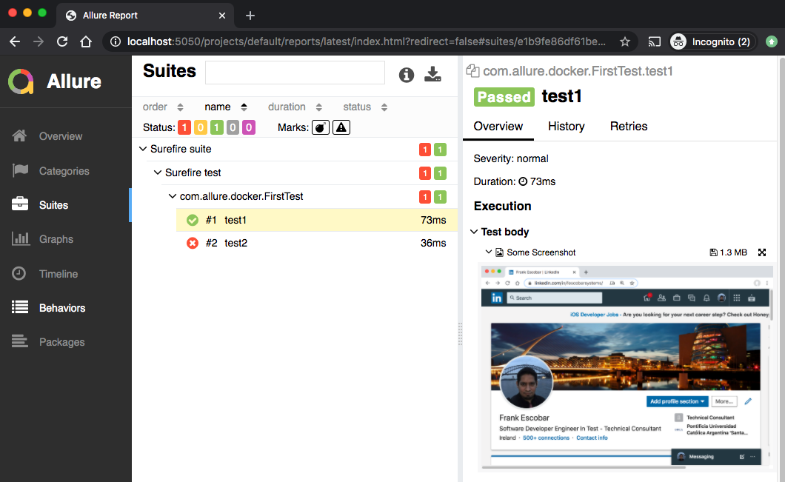
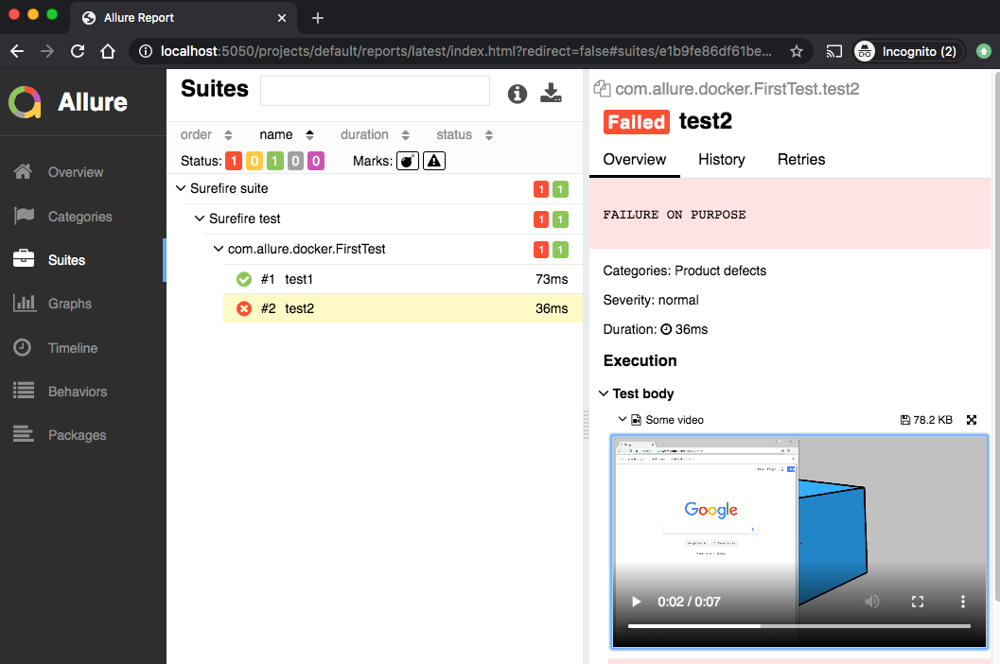
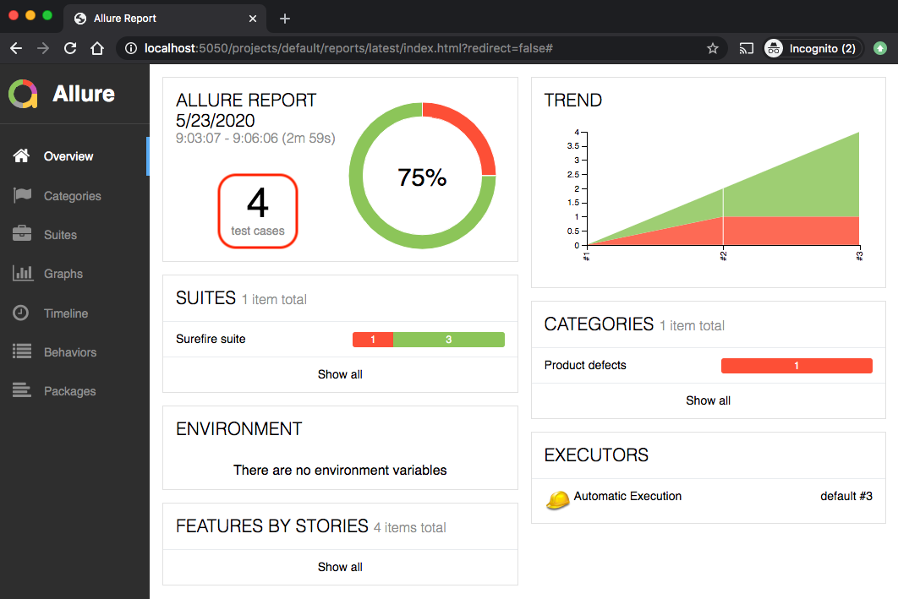
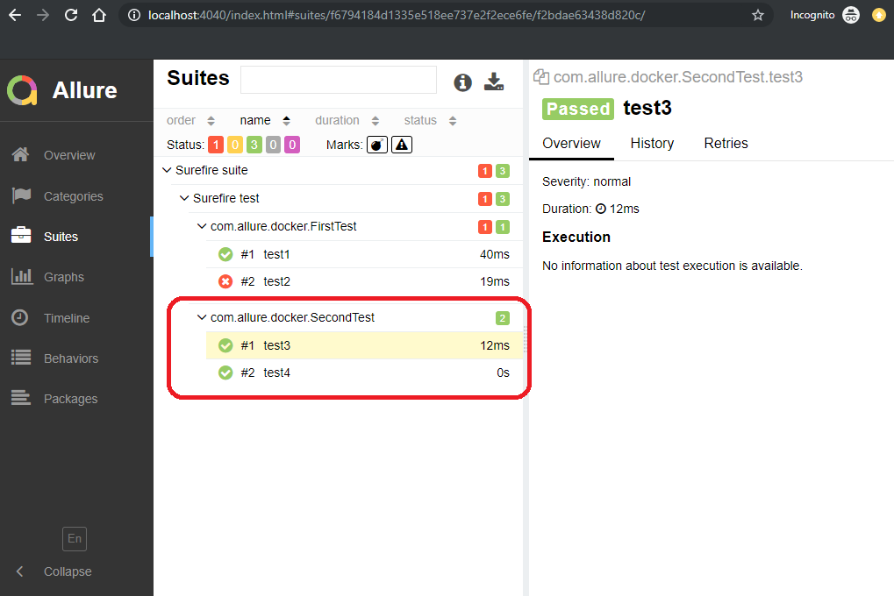

[](http://allure.qatools.ru/)
[](https://docs.docker.com/)

# Allure Docker Service

## FEATURES
Allure Framework provides you beautiful reports for testing.
For using this tool is necessary to have a server. You can have this server running on Jenkins or when you want to see the report locally you have to install the server on your machine or you have to run extra commands. This work results tedious, at least for me :)

For that reason this docker container allows you to see the reports updated simply mounting your `allure-results` directory in the container. Each time that appears new results (generated for your tests), Allure Docker Service will detect those new results files and will generate automatically a new report, what you can see refreshing your browser.

It's useful even for developers who wants to run your tests locally and want to see what were the problems during regressions.

## USAGE
### Generate Allure Results
First at all it's important to be clear. This container only generate reports based on results. You have to generate allure results according to the technology what are you using.

In this case we are going to generate results using the project [allure-docker-java-example](allure-docker-java-example) of this repository.

Go to directory [allure-docker-java-example](allure-docker-java-example) and execute:

```sh
mvn test -Dtest=FirstTestNGAllureTest
```
If everything is OK, you should see something like this:

```sh
[INFO] -------------------------------------------------------
[INFO]  T E S T S
[INFO] -------------------------------------------------------
[INFO] Running com.allure.docker.FirstTestNGAllureTest
SLF4J: Failed to load class "org.slf4j.impl.StaticLoggerBinder".
SLF4J: Defaulting to no-operation (NOP) logger implementation
SLF4J: See http://www.slf4j.org/codes.html#StaticLoggerBinder for further details.
test1
test2
[ERROR] Tests run: 2, Failures: 1, Errors: 0, Skipped: 0, Time elapsed: 2.419 s <<< FAILURE! - in com.allure.docker.FirstTestNGAllureTest
[ERROR] test2(com.allure.docker.FirstTestNGAllureTest)  Time elapsed: 0.042 s  <<< FAILURE!
java.lang.AssertionError: ERROR DURING THE TEST
        at com.allure.docker.FirstTestNGAllureTest.test2(FirstTestNGAllureTest.java:42)

[INFO] 
[INFO] Results:
[INFO] 
[ERROR] Failures: 
[ERROR]   FirstTestNGAllureTest.test2:42 ERROR DURING THE TEST
[INFO] 
[ERROR] Tests run: 2, Failures: 1, Errors: 0, Skipped: 0
[INFO] 
[INFO] ------------------------------------------------------------------------
[INFO] BUILD FAILURE
[INFO] ------------------------------------------------------------------------
```

There are 2 tests, one of them failed. Now you can see the `allure-results` diretory was created inside of [allure-docker-java-example](allure-docker-java-example) project.

Just it has left 1 step more. You have to mount your 'allure-results' directory to the container.

NOTE: You can have this directory anywhere. The important is your project must generate results in that directory.

### Docker
Docker Image: https://hub.docker.com/r/frankescobar/allure-docker-service/

#### Unix/Mac
```sh
docker run -p 4040:4040 -v ${PWD}/allure-docker-java-example/allure-results:/app/allure-results frankescobar/allure-docker-service
```

#### Windows (Git Bash)
```sh
docker run -p 4040:4040 -v "/$(pwd)/allure-docker-java-example/allure-results:/app/allure-results" frankescobar/allure-docker-service
```

### Docker Compose
Using docker-compose is the best way to manage containers
`docker-compose.yml`
```sh
version: '3'

  allure:
    image: "frankescobar/allure-docker-service"
    environment:
      CHECK_RESULTS_EVERY_SECONDS: 1
    ports:
      - "4040:4040"
    volumes:
      - "${PWD}/allure-results:/app/allure-results"
```
Example:
[allure-docker-java-example/docker-compose.yml](allure-docker-java-example/docker-compose.yml)

### Opening & Refreshing Report
If everything was OK, you will see this:
```sh
Generating default report
Generating report
Overriding configuration
Checking Allure Results each 1 second/s
Detecting new results...
Generating report
Report successfully generated to allure-report
Report successfully generated to allure-report
Starting web server...
2018-10-09 09:45:52.019:INFO::main: Logging initialized @773ms to org.eclipse.jetty.util.log.StdErrLog
Can not open browser because this capability is not supported on your platform. You can use the link below to open the report manually.
Server started at <http://172.25.0.2:4040/>. Press <Ctrl+C> to exit
```

All previous examples started the container using port 4040. Simply open your browser and access to: 

http://localhost:4040

[](images/allure01.png)

[](images/allure02.png)

[](images/allure03.png)

Now we can run other tests without be worried about Allure server. You don't need to restart or execute any Allure command.

Just execute another suite test:

```sh
mvn test -Dtest=SecondTestNGAllureTest
```
When that test finished, refresh your browser and you will see there is a new report including last results tests.

[](images/allure04.png)

[](images/allure05.png)

### Extra options
#### Changing port
Exposing Allure report in port 8484. Docker Compose example:
```sh
    ports:
      - "8484:4040"
```
#### Updating seconds to check Allure Results
Updating seconds to check `allure-results` directory to generate report updated. Docker Compose example:
```sh
    environment:
      CHECK_RESULTS_EVERY_SECONDS: 5
```

## NOTE:
The script 
[checkAllureResultsFiles.sh](checkAllureResultsFiles.sh) is a temporaly workaround to discover when there are new files in the `allure-results` directory. [inotify](https://www.systutorials.com/docs/linux/man/7-inotify/) would be the best way to implement this functionality, but at the moment is not exist a proper fixed to work with Docker/Windows https://github.com/docker/for-win/issues/56.


## DOCKER GENERATION (Usage for developers)
### Install Docker
```sh
sudo apt-get update
```
```sh
sudo apt install -y docker.io
```
If you want to use docker without sudo, read following links:
https://docs.docker.com/engine/installation/linux/linux-postinstall/#manage-docker-as-a-non-root-user

https://stackoverflow.com/questions/21871479/docker-cant-connect-to-docker-daemon

### Build image
```sh
docker build -t 2.7.0-allure .
```
### Run container
```sh
docker run -d -p 4040:4040 2.7.0-allure
```
### See active containers
```sh
docker container ls
```
### Access to container
```sh
docker exec -it ${CONTAINER_ID} bash
```
### Access to logs
```sh
docker exec -it ${CONTAINER_ID} tail -f log
```
### Remove all containers
```sh
docker container rm $(docker container ls -a -q) -f
```
### Remove all images
```sh
docker image rm $(docker image ls -a -q)
```
### Register image (Example)
```sh
docker login
docker tag 2.7.0-allure frankescobar/allure-docker-service
docker push frankescobar/allure-docker-service
```
### Download image registered (Example)
```sh
docker run -d -p 4040:4040 frankescobar/allure-docker-service
```

### Issue - bad interpreter: No such file or directory
When you run the container (depending of your OS) it could appears this error:
```sh
./runAllure.sh: /app/generateAllureReport.sh: /bin/bash^M: bad interpreter: No such file or directory
```

Just run next command to fix it:
```sh
sed -i -e 's/\r$//' runAllure.sh checkAllureResultsFiles.sh generateAllureReport.sh
```
