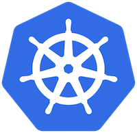

[](http://allure.qatools.ru/)
[](https://docs.docker.com/)
[](https://kubernetes.io/)

# ALLURE-DOCKER-SERVICE KUBERNETES EXAMPLE
Table of contents
=================
* [USAGE](#USAGE)
    * [Creating a Namespace](#creating-a-namespace)
    * [Creating a Config Map](#creating-a-config-map)
    * [Creating a Persistent Volume](#creating-a-persistent-volume)
    * [Creating a Persistent Volume Claim](#creating-a-persistent-volume-claim)
    * [Creating a Deployment](#creating-a-deployment)
    * [Creating a Service](#creating-a-service)
        * [Creating a Load Balancer Service](#creating-a-load-balancer-service)
        * [Creating a Node Port Service](#creating-a-node-port-service)
    * [Creating a SSL certificate and key](#creating-a-ssl-certificate-and-key)
    * [Creating a TLS Secret](#creating-a-tls-secret)
    * [Creating an Ingress](#creating-an-ingress)
        * [Creating an Ingress for Load Balancer](#creating-an-ingress-for-load-balancer)
        * [Creating an Ingress for Node Port](#creating-an-ingress-for-node-port)
    * [Using Application Deployed](#using-application-deployed)
    * [Removing all allure objects created](#removing-all-allure-objects-created)

## USAGE

The commands were checked using `Docker Desktop`. Adapt any definition yaml according your needs and infrastructure.

Before starting, we are going to check if we have some objects created in the namespace `allure-docker-service`

```sh
kubectl get all -o wide --namespace allure-docker-service
```

```sh
No resources found.
```

### Creating a Namespace
Check yaml definition here: [allure-namespace.yml](allure-namespace.yml)

- Create a namespace
```sh
kubectl create -f allure-namespace.yml
```
Output:
```sh
namespace/allure-docker-service created
```

- Get namespaces
```sh
kubectl get namespaces
```
Output:
```sh
NAME                    STATUS    AGE
allure-docker-service   Active    4s
```


### Creating a Config Map
Check yaml definition here: [allure-config-map.yml](allure-config-map.yml)

For this example, we are going to enable `TLS` option to use `https` protocol. Otherwise, remove that option.
```sh
TLS: "1"
```
Note: It's necessary to use `TLS` in case you expose the application publicly.

- Create a config map
```sh
kubectl create -f allure-config-map.yml
```
Output:
```sh
configmap/allure-config-map created
```

- Get configmaps
```sh
kubectl get configmaps --namespace allure-docker-service
```
Output:
```sh
NAME                DATA      AGE
allure-config-map   3         58s
```

- Describe configmap created
```sh
kubectl describe configmap allure-config-map --namespace allure-docker-service
```
Output:
```sh
Name:         allure-config-map
Namespace:    allure-docker-service
Labels:       <none>
Annotations:  <none>

Data
====
CHECK_RESULTS_EVERY_SECONDS:
----
NONE
KEEP_HISTORY:
----
1
TLS:
----
1
Events:  <none>
```

### Creating a Persistent Volume
Check yaml definition here: [allure-persistent-volume.yml](allure-persistent-volume.yml)

If you are using a Kubernetes cloud solution, surely you don't need to create a `persistent volume` from your own, due the cloud solutions provision their own persistent volumes types.

We are using `hostPath` in the yaml definition example. This is something that you only should use for development/testing purposes. A `hostPath` PersistentVolume uses a file or directory on the Node to emulate network-attached storage.

For live/production environments you should use a cloud solution like a `Google Compute Engine persistent disk` or an `Amazon Elastic Block Store volume`. Example:
```sh
    awsElasticBlockStore:
        volumeID: <volume-id>
        fsType: ext4
```
You can check other alternatives here: https://kubernetes.io/docs/concepts/storage/persistent-volumes/#types-of-persistent-volumes

- Create a persisent volume
```sh
kubectl create -f allure-persistent-volume.yml
```
Output:
```sh
persistentvolume/allure-persistent-volume created
```

- Get persistent volumes
```sh
kubectl get persistentvolumes
```
Output:
```sh
NAME                       CAPACITY   ACCESS MODES   RECLAIM POLICY   STATUS      CLAIM     STORAGECLASS   REASON    AGE
allure-persistent-volume   3Gi        RWO            Retain           Available                                      40s
```

- Describe persistent volume created
```sh
kubectl describe persistentvolumes allure-persistent-volume
```
Output:
```
Name:            allure-persistent-volume
Labels:          <none>
Annotations:     <none>
Finalizers:      [kubernetes.io/pv-protection]
StorageClass:    
Status:          Available
Claim:           
Reclaim Policy:  Retain
Access Modes:    RWO
VolumeMode:      Filesystem
Capacity:        3Gi
Node Affinity:   <none>
Message:         
Source:
    Type:          HostPath (bare host directory volume)
    Path:          /allure/projects
    HostPathType:  
Events:            <none>
```

References:
- https://kubernetes.io/docs/tasks/configure-pod-container/configure-persistent-volume-storage/#create-a-persistentvolume


### Creating a Persistent Volume Claim
Check yaml definition here: [allure-persistent-volume-claim.yml](allure-persistent-volume-claim.yml)

- Create a persistent volume claim
```sh
kubectl create -f allure-persistent-volume-claim.yml
```
Output:
```sh
persistentvolumeclaim/allure-persistent-volume-claim created
```

- Get persistent volume claims
```sh
kubectl get persistentvolumeclaims --namespace allure-docker-service
```
Output:
```sh
NAME                             STATUS    VOLUME                                     CAPACITY   ACCESS MODES   STORAGECLASS   AGE
allure-persistent-volume-claim   Bound     pvc-8569678e-b722-4a23-bcb8-494657f57505   3Gi        RWO            hostpath       33s
```

- Describe persistent volume claim created
```sh
kubectl describe persistentvolumeclaims allure-persistent-volume-claim --namespace allure-docker-service
```
Output:
```sh
Name:          allure-persistent-volume-claim
Namespace:     allure-docker-service
StorageClass:  hostpath
Status:        Bound
Volume:        pvc-d8590772-d0c1-48fa-9301-cfdec7f5c539
Labels:        <none>
Annotations:   pv.kubernetes.io/bind-completed=yes
               pv.kubernetes.io/bound-by-controller=yes
               volume.beta.kubernetes.io/storage-provisioner=docker.io/hostpath
Finalizers:    [kubernetes.io/pvc-protection]
Capacity:      3Gi
Access Modes:  RWO
VolumeMode:    Filesystem
Events:
  Type    Reason                 Age   From                                                                         Message
  ----    ------                 ----  ----                                                                         -------
  Normal  ExternalProvisioning   16s   persistentvolume-controller                                                  waiting for a volume to be created, either by external provisioner "docker.io/hostpath" or manually created by system administrator
  Normal  Provisioning           16s   docker.io/hostpath_storage-provisioner_5c48106f-e3e7-47ef-b82d-166da949db34  External provisioner is provisioning volume for claim "allure-docker-service/allure-persistent-volume-claim"
  Normal  ProvisioningSucceeded  16s   docker.io/hostpath_storage-provisioner_5c48106f-e3e7-47ef-b82d-166da949db34  Successfully provisioned volume pvc-d8590772-d0c1-48fa-9301-cfdec7f5c539
```

### Creating a Deployment
Check yaml definition here: [allure-deployment.yml](allure-deployment.yml)

- Create a deployment
```sh
kubectl create -f allure-deployment.yml
```
Output:
```sh
deployment.apps/allure-deployment created
```

- Get all objects
```
kubectl get all -o wide --namespace allure-docker-service
```
Output:
```
NAME                                     READY     STATUS    RESTARTS   AGE       IP          NODE             NOMINATED NODE   READINESS GATES
pod/allure-deployment-7cd5fbf5cd-vm6jd   1/1       Running   0          6s        10.1.0.82   docker-desktop   <none>           <none>

NAME                                READY     UP-TO-DATE   AVAILABLE   AGE       CONTAINERS   IMAGES                                    SELECTOR
deployment.apps/allure-deployment   1/1       1            1           6s        allure       frankescobar/allure-docker-service:beta   type=app

NAME                                           DESIRED   CURRENT   READY     AGE       CONTAINERS   IMAGES                                    SELECTOR
replicaset.apps/allure-deployment-7cd5fbf5cd   1         1         1         6s        allure       frankescobar/allure-docker-service:beta   pod-template-hash=7cd5fbf5cd,type=app
```

In this case, the pod created has this name assigned `allure-deployment-7cd5fbf5cd-vm6jd`
```sh
POD_NAME=`allure-deployment-7cd5fbf5cd-vm6jd`
```
- Check if the application was deployed successfully in the pod

```sh
kubectl exec -it ${POD_NAME} curl http://localhost:5050 --namespace allure-docker-service
```
Output:
```sh
<html>

<head>
    <title>Allure Docker Service</title>
    <link rel="shortcut icon" href="/static/favicon">
    <meta http-equiv="Refresh" content="0; url=/allure-docker-service/swagger"/>
</head>

<body>
</body>

</html>% 
```

- See logs in real time
```sh
kubectl logs -f ${POD_NAME} --namespace allure-docker-service
```
Output:
```sh
Not checking results automatically
ALLURE_VERSION: 2.13.5
Generating default report
Creating results directory for PROJECT_ID: default
Creating executor.json for PROJECT_ID: default
Generating report for PROJECT_ID: default
Report successfully generated to /app/allure-docker-api/static/projects/default/reports/latest
Status: 200
2020-06-23 15:51:19.455:INFO::main: Logging initialized @861ms to org.eclipse.jetty.util.log.StdErrLog
```

NOTE: Don't forget to replace the name of your pod in your case


### Creating a Service
You have 2 options for creating a service exposed for the user

#### Creating a Load Balancer Service
Check yaml definition here: [allure-service-load-balancer.yml](allure-service-load-balancer.yml)

For this example, we are going to expose the service in the port `6060`

- Create a load balancer service
```sh
kubectl create -f allure-service-load-balancer.yml
```
Output:
```sh
service/allure-service-load-balancer created
```

- Get services
```sh
kubectl get services --namespace allure-docker-service
```
Output:
```sh
NAME                           TYPE           CLUSTER-IP     EXTERNAL-IP   PORT(S)          AGE
allure-service-load-balancer   LoadBalancer   10.108.43.57   localhost     6060:32332/TCP   8s
```

- Describe service created
```sh
kubectl describe service allure-service-load-balancer --namespace allure-docker-service
```
Output:
```sh
Name:                     allure-service-load-balancer
Namespace:                allure-docker-service
Labels:                   <none>
Annotations:              <none>
Selector:                 type=app
Type:                     LoadBalancer
IP:                       10.108.43.57
LoadBalancer Ingress:     localhost
Port:                     <unset>  6060/TCP
TargetPort:               5050/TCP
NodePort:                 <unset>  32332/TCP
Endpoints:                10.1.0.82:5050
Session Affinity:         None
External Traffic Policy:  Cluster
Events:                   <none>
```

- Verify if service is working properly
```sh
curl http://${IP_NODE}:6060 -ik
```
or use `localhost` in case you are in the node where the pod is deployed

```sh
curl http://localhost:6060/ -ik
```
Output:
```sh
HTTP/1.1 200 OK
Content-Length: 223
Content-Type: text/html; charset=utf-8
Date: Thu, 25 Jun 2020 12:42:23 GMT
Server: waitress

<html>

<head>
    <title>Allure Docker Service</title>
    <link rel="shortcut icon" href="/static/favicon">
    <meta http-equiv="Refresh" content="0; url=/allure-docker-service/swagger"/>
</head>

<body>
</body>

</html>%
```

#### Creating a Node Port Service
Check yaml definition here: [allure-service-node-port.yml](allure-service-node-port.yml)

For this example, we are going to expose the service in the port `30008`

- Create a node port service
```sh
kubectl create -f allure-service-node-port.yml
```
Output:
```sh
service/allure-service-node-port created
```

- Get services
```sh
kubectl get services --namespace allure-docker-service
```
Output:
```sh
NAME                           TYPE           CLUSTER-IP      EXTERNAL-IP   PORT(S)          AGE
allure-service-node-port       NodePort       10.110.92.76   <none>        2020:30008/TCP   9s
```

- Describe service created
```sh
kubectl describe service allure-service-node-port --namespace allure-docker-service
```
Output:
```sh
Name:                     allure-service-node-port
Namespace:                allure-docker-service
Labels:                   <none>
Annotations:              <none>
Selector:                 type=app
Type:                     NodePort
IP:                       10.110.92.76
LoadBalancer Ingress:     localhost
Port:                     <unset>  2020/TCP
TargetPort:               5050/TCP
NodePort:                 <unset>  30008/TCP
Endpoints:                10.1.0.82:5050
Session Affinity:         None
External Traffic Policy:  Cluster
Events:                   <none>
```

- Verify if service is working properly
```sh
curl http://${IP_NODE}:30008 -ik
```
or use `localhost` in case you are in the node where the pod is deployed
```sh
curl http://localhost:30008 -ik
```
Output:
```sh
HTTP/1.1 200 OK
Content-Length: 223
Content-Type: text/html; charset=utf-8
Date: Thu, 25 Jun 2020 12:43:00 GMT
Server: waitress

<html>

<head>
    <title>Allure Docker Service</title>
    <link rel="shortcut icon" href="/static/favicon">
    <meta http-equiv="Refresh" content="0; url=/allure-docker-service/swagger"/>
</head>

<body>
</body>

</html>%
```

### Creating a SSL certificate and key
If you have an existing certificate/key ready to use you can skip this section.

- Create a certificate/key
For this example, we are going to create a certificate/key for domain `my-domain.com`
```sh
openssl req -x509 -newkey rsa:4096 -sha256 -nodes -keyout tls.key -out tls.crt -subj "/CN=my-domain.com"
```
Output
```sh
Generating a 4096 bit RSA private key
......++
......................................................................................................................................................++
writing new private key to 'tls.key'
-----
```

### Creating a TLS Secret
- Create a TLS secret
Create TLS secret using certificate and key files generated previously
```sh
kubectl create secret tls my-domain-com-tls --cert=tls.crt --key=tls.key --namespace=allure-docker-service
```
Output:
```sh
secret/my-domain-com-tls created
```
- Get secrets
```sh
kubectl get secrets --namespace allure-docker-service
```
Output:
```sh
NAME                            TYPE                                  DATA      AGE
my-domain-com-tls           kubernetes.io/tls                          2        64s
```

### Creating an Ingress
- As pre-requisite you need to have an Ingress Controller to be able to use ingress. 
For example, you can install `ingress-nginx` --> https://kubernetes.github.io/ingress-nginx/deploy/


- If you are using kubernetes locally, as you don't have a DNS you can edit the file `/etc/hosts`
```sh
sudo vi /etc/hosts
```
and add the next line at the end
```sh
127.0.0.1   my-domain.com
```
On that way, when you request `my-domain.com` you will be re-directed to `localhost`

- Remove `TLS` section in the ingress yaml definition in case you don't want to use `https` protocol.

Reference:
- https://kubernetes.io/docs/concepts/services-networking/ingress/

#### Creating an Ingress for Load Balancer
Check yaml definition here: [allure-ingress-service-load-balancer.yml](allure-ingress-service-load-balancer.yml)

- Create an ingress
```sh
kubectl create -f allure-ingress-service-load-balancer.yml
```
Output:
```sh
ingress.networking.k8s.io/allure-ingress-service-load-balancer created
```
- Get ingress
```sh
kubectl get ingress --namespace allure-docker-service
```
Output:
```sh
NAME                                   HOSTS           ADDRESS   PORTS     AGE
allure-ingress-service-load-balancer   my-domain.com             80, 443   18s
```

- Check if ingress is working
```sh
curl https://my-domain.com/allure-docker-service -ik
```
Output:
```sh
HTTP/2 200 
server: nginx/1.19.0
date: Thu, 25 Jun 2020 11:53:13 GMT
content-type: text/html; charset=utf-8
content-length: 223
strict-transport-security: max-age=15724800; includeSubDomains

<html>

<head>
    <title>Allure Docker Service</title>
    <link rel="shortcut icon" href="/static/favicon">
    <meta http-equiv="Refresh" content="0; url=/allure-docker-service/swagger"/>
</head>

<body>
</body>

</html>% 
```


#### Creating an Ingress for Node Port
Check yaml definition here: [allure-ingress-service-node-port.yml](allure-ingress-service-node-port.yml)

- Create an ingress
```sh
kubectl create -f allure-ingress-service-node-port.yml
```
Output:
```sh
ingress.networking.k8s.io/allure-ingress-service-node-port created
```
- Get ingress
```sh
kubectl get ingress --namespace allure-docker-service
```
Output:
```sh
NAME                               HOSTS           ADDRESS     PORTS     AGE
allure-ingress-service-node-port   my-domain.com   localhost   80, 443   8s
```

- Check if ingress is working
```sh
curl https://my-domain.com/allure-docker-service -ik
```
Output:
```sh
HTTP/2 200 
server: nginx/1.19.0
date: Thu, 25 Jun 2020 12:27:41 GMT
content-type: text/html; charset=utf-8
content-length: 223
strict-transport-security: max-age=15724800; includeSubDomains

<html>

<head>
    <title>Allure Docker Service</title>
    <link rel="shortcut icon" href="/static/favicon">
    <meta http-equiv="Refresh" content="0; url=/allure-docker-service/swagger"/>
</head>

<body>
</body>

</html>% 
```

### Using Application Deployed
You can start using `Allure Docker Service` in Kubernetes like this:
```sh
curl https://my-domain.com/allure-docker-service/version -ik
```
Output:
```sh
HTTP/2 200
server: nginx/1.19.0
date: Thu, 25 Jun 2020 15:13:16 GMT
content-type: application/json
content-length: 86
strict-transport-security: max-age=15724800; includeSubDomains

{"data":{"version":"2.13.5"},"meta_data":{"message":"Version successfully obtained"}}
```


```sh
curl https://my-domain.com/allure-docker-service/projects -ik
```
```sh
HTTP/2 200
server: nginx/1.19.0
date: Thu, 25 Jun 2020 15:14:19 GMT
content-type: application/json
content-length: 162
strict-transport-security: max-age=15724800; includeSubDomains

{"data":{"projects":{"default":{"uri":"https://my-domain.com/allure-docker-service/projects/default"}}},"meta_data":{"message":"Projects successfully obtained"}}
```

Check scripts https://github.com/fescobar/allure-docker-service/tree/beta#send-results-through-api where the `allure server url` would be `https://my-domain.com`

Note:
- If when you try to request the endpoint `POST /send-results` returns `413 Request Entity Too Large` like this:
```sh
HTTP/2 413
server: nginx/1.19.0
date: Thu, 25 Jun 2020 13:22:39 GMT
content-type: text/html
content-length: 183
strict-transport-security: max-age=15724800; includeSubDomains

<html>
<head><title>413 Request Entity Too Large</title></head>
<body>
<center><h1>413 Request Entity Too Large</h1></center>
<hr><center>nginx/1.19.0</center>
</body>
</html>
```
You have to setup your ingress controller to increase the body size

If you are using `ingress-nginx` controller:
```sh
kubectl edit configmap ingress-nginx-controller --namespace ingress-nginx
```
Add the next configuration"
```sh
data:
  proxy-body-size: "500m"
```
References:
- https://kubernetes.github.io/ingress-nginx/user-guide/nginx-configuration/annotations/#custom-max-body-size
- https://github.com/kubernetes/ingress-nginx/blob/master/docs/user-guide/nginx-configuration/annotations.md#custom-max-body-size


### Removing all allure objects created
- Execute bash script [delete-allure-k8s-objects.sh](delete-allure-k8s-objects.sh)
```sh
./delete-allure-k8s-objects.sh
```
